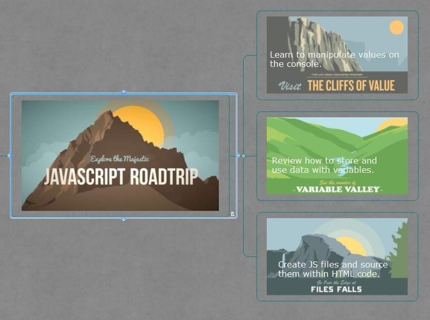

##Level 1 The Cliffs of Value
[link to source](https://github.com/tsvetkovpro/js/tree/master/courses/codeschool/js-road-trip-1/level-1)
```
1. Common Operators used in JavaScript Syntax: addition, subtraction, multiplication, division, modulus - Modulus returns the remainder after division.
2. Grouping Expressions in JavaScript
3. Common Number Comparators used in JavaScript Syntax: >, ==, <, !=, >=, <=
4. Strings, Special characters inside Strings, String Comparisons

```

##Level 2 Variable Valley
[link to source](https://github.com/tsvetkovpro/js/tree/master/courses/codeschool/js-road-trip-1/level-2)
```
1. storing, naming variables, changing variable contents, using, incrementing and decrementing
```

##Level 3 Files Falls
[link to source](https://github.com/tsvetkovpro/js/tree/master/courses/codeschool/js-road-trip-1/level-3/files)
```
1. Printing from a file to the console
2. Using console.log  in js file
```



