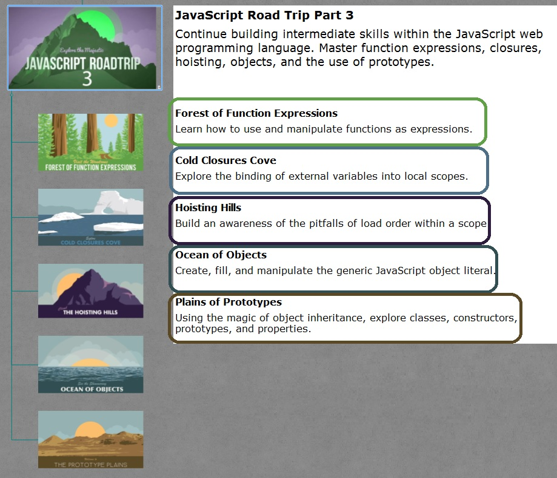

##Level 1 Forest of Function Expressions
[link to source](https://github.com/tsvetkovpro/js/tree/master/cources/codeschool/js-road-trip-3/level-1)
```
Learn how to use and manipulate functions as expressions.
```

##Level 2 Cold Closures Cove
[link to source](https://github.com/tsvetkovpro/js/tree/master/cources/codeschool/js-road-trip-3/level-2)
```
Explore the binding of external variables into local scopes.
```

##Level 3 Hoisting Hills
[link to source](https://github.com/tsvetkovpro/js/tree/master/cources/codeschool/js-road-trip-3/level-3/hoisting-hills)
```
Build an awareness of the pitfalls of load order within a scope.
```

##Level 4 Ocean of Objects
[link to source](https://github.com/tsvetkovpro/js/tree/master/cources/codeschool/js-road-trip-3/level-4)
```
Create, fill, and manipulate the generic JavaScript object literal.
```

##Level 5 Plains of Prototypes
[link to source](https://github.com/tsvetkovpro/js/tree/master/cources/codeschool/js-road-trip-3/level-5)
```
Using the magic of object inheritance, explore classes, constructors, prototypes, and properties.
```


* [pdf cource description](https://github.com/tsvetkovpro/js/blob/master/cources/codeschool/js-road-trip-3/js3.pdf)



