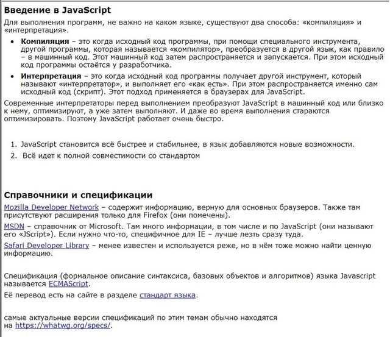
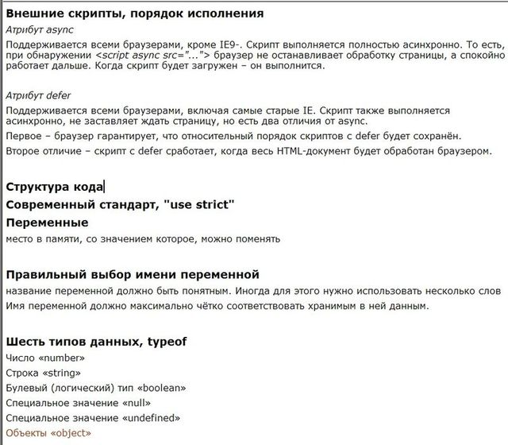

# Современный учебник JavaScript
[источник](https://learn.javascript.ru/)

[исходные коды](https://github.com/tsvetkovpro/js/tree/master/courses/others/learn.javascript/js)
```
Перед вами учебник по JavaScript, начиная с основ, включающий в себя много тонкостей и фишек JavaScript/DOM.
```


## I: Язык JavaScript
```
Эта часть позволит вам изучить JavaScript с нуля или упорядочить и дополнить существующие знания.
Мы будем использовать браузер в качестве окружения, но основное внимание будет уделяться именно самому языку JavaScript.
```


### Введение

```
Про язык JavaScript и окружение для разработки на нём.
```



### Основы JavaScript

```
Основные кирпичики, из которых состоят скрипты.
```



### Качество кода

```
Для того, чтобы код был качественным, необходимы как минимум:
- Умение отладить код и поправить ошибки.
- Хороший стиль кода.
- Тестировать код, желательно – в автоматическом режиме.
```


### Структуры данных

```
Изучаем JavaScript: расширенное знакомство со встроенными типами данных, их особенностями.
```


### Замыкания, область видимости

```
Понимание «области видимости» и «замыканий» – ключевое в изучении JavaScript, без них «каши не сваришь».

В этом разделе мы более глубоко изучаем переменные и функции – и замыкания в том числе.
```


### Методы объектов и контекст вызова

```
Начинаем изучать объектно-ориентированную разработку – как работают объекты и функции, что такое контекст вызова и способы его передачи.
```


### Некоторые другие возможности

```
Различные возможности JavaScript, которые достаточно важны, но не заслужили отдельного раздела.
```


### ООП в функциональном стиле

```
Инкапсуляция и наследование в функциональном стиле, а также расширенные возможности объектов JavaScript.
```


### ООП в прототипном стиле

```
В этом разделе мы изучим прототипы и классы на них – де-факто стандарт объектно-ориентированной разработки в JavaScript.
```


### Современные возможности ES-2015

```
Современный стандарт ES-2015 и его расширения для JavaScript.
```


---

<br />
<br />
<br />
<br />

## II: Документ, события, интерфейсы 
[]()
```
Изучаем работу со страницей – как получать элементы, манипулировать их размерами, динамически создавать интерфейсы и взаимодействовать с посетителем.
```

### Документ и объекты страницы

```
При помощи JavaScript получаем и меняем существующие элементы на странице, а также создаём новые.
```


### Основы работы с событиями

```
Введение в браузерные события, общие свойства всех событий и приёмы работы с ними.
```


### События в деталях

```
В этом разделе мы разбираем конкретные события и особенности работы с ними.

Вы можете читать его в любом порядке или кратко просмотреть его и вернуться к конкретным событиям, когда они понадобятся.
```


### Формы, элементы управления

```
Особые свойства, методы и события для работы с формами <form> и элементами ввода: <input>, <select> и другими.
```


### Создание графических компонентов

```
В этом разделе мы обсуждаем, как вместо «простыни кода» писать объектно-ориентированные компоненты на JavaScript.
```


